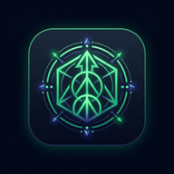

# AlignOS — The Autonomous Personal Life Operating System

<p align="center">
  
</p>

<p align="center">
  <strong>A high-performance, offline-first personal operating system designed to unify daily habits, deep work timers, financial intelligence, sleep rhythm, and daily alignment score into a cohesive flow.</strong>
</p>

<p align="center">
  
  
  
  
</p>

---

## 📱 Instant Live Preview & Cross-Platform Access

Try the application on your physical smartphone (**iOS** or **Android**) without compiling from source:

<p align="center">
  <br/>
  <sub><b>Point your iPhone or Android camera at the QR code above</b></sub><br/>
  <sub>or visit: <a href="https://ais-dev-fxwr6z7fwcj6zsjodmw7vt-383093575782.europe-west3.run.app">https://ais-dev-fxwr6z7fwcj6zsjodmw7vt-383093575782.europe-west3.run.app</a></sub>
</p>

### Adding to Home Screen (Native Feel)
* **iOS (iPhone 12/13/14/15/16)**: Open the link in **Safari** &rarr; tap the **Share** button &rarr; tap **"Add to Home Screen"**. The custom high-resolution emblem installs directly onto your springboard.
* **Android**: Open in **Chrome** &rarr; tap **"Install App"** from the bottom drawer or menu.

---

## ⚡ Key Highlights & Core Pillars

AlignOS eliminates app-switching fragmentation by combining five critical personal productivity pillars into a single reactive engine:

1. **Daily Dynamic Alignment Engine**: Computes a real-time 0–100% weighted score driven by task completion, habit consistency, deep-work focus time, and budget adherence.
2. **Offline-First Persistence**: Powered by **Room Database** (SQLite) with zero cloud lock-in. Full CRUD operations, state persistence, and instant queries with local data privacy.
3. **Deep Focus Chronometer**: Interactive Pomodoro / Stopwatch focus session manager linked directly to tasks and mental reflections.
4. **Financial Velocity Tracker**: Track income, fixed expenses, discretionary burn rates, and net cashflow balance in real time.
5. **Circadian Sleep & Recovery Journal**: Logs sleep duration, sleep quality index, and daily cognitive reflections with historical trend reviews.

---

## 🏗️ Architecture & Technology Stack

AlignOS is engineered following industry-standard Clean Architecture principles with unidirectional data flow (UDF):

```
app/
├── src/main/java/com/example/
│   ├── data/
│   │   ├── local/          # Room Database, Type Converters, DAO interfaces & Entities
│   │   ├── model/          # Domain Models & Sealed UI State classes
│   │   └── repository/     # Repository pattern abstracting local data sources
│   ├── ui/
│   │   ├── components/     # Reusable Compose widgets (Gauges, NavBars, Modals)
│   │   ├── screens/        # Modular screen composables (Today, Focus, Finance, Sleep)
│   │   ├── theme/          # Material 3 Color Schemes, Typography, Shapes
│   │   └── viewmodel/      # Centralized AlignViewModel managing StateFlows & Coroutines
│   ├── util/               # Date utilities, formatting, calculation engines
│   └── MainActivity.kt     # Single Activity entry point with Edge-to-Edge display
```

### Technology Matrix

| Layer | Technology | Purpose |
|---|---|---|
| **Language** | Kotlin 2.0+ | Modern expressive syntax with strict null safety |
| **UI Toolkit** | Jetpack Compose (Material 3) | Declarative, reactive UI with dynamic dark/light surfaces |
| **State Management** | Kotlin Coroutines & `StateFlow` | Asynchronous, lifecycle-aware unidirectional data flow |
| **Local Database** | Room (SQLite) + KSP | Type-safe persistence layer with Room DAOs and Entity relations |
| **Navigation** | Navigation Compose | Type-safe declarative single-activity routing |
| **Cross-Platform PWA** | Modern Web Standards & Service Worker | Instant zero-install experience on iOS and Android |

---

## 🚀 Installation & Local Development

### Prerequisites
* **Android Studio** Ladybug (2024.2+) or newer
* **JDK 17** or **JDK 21**
* **Android SDK**: API Level 34 (Android 14) or API Level 35

### 1. Clone the Repository
```bash
git clone https://github.com/your-username/alignos.git
cd alignos
```

### 2. Configure Environment Variables
Create a `.env` file in the root project folder:
```env
GEMINI_API_KEY=dummy_key_12345
```

### 3. Build & Run from Command Line
To build the debug APK directly:
```bash
./gradlew assembleDebug
```
The compiled binary will be located at:
```
app/build/outputs/apk/debug/app-debug.apk
```

### 4. Deploy Directly to a Physical Android Device
Ensure USB Debugging is enabled on your device:
```bash
adb install -r app/build/outputs/apk/debug/app-debug.apk
adb shell monkey -p com.aistudio.alignos.vwyxqt -c android.intent.category.LAUNCHER 1
```

---

## 📸 Screenshots & Showcase

| Dashboard & Alignment Gauge | Focus Timer & Deep Work | Finance & Cash Flow |
|:---:|:---:|:---:|
|  |  |  |
| Real-time 0–100% daily alignment | Interval focus timer with reflections | Complete income & expense tracking |

---

## 🧪 Testing & Code Quality

* **Local Unit Tests**: Executed via standard JVM test runners for domain models and calculators.
* **Robolectric Local Tests**: Full Android lifecycle tests without needing an active emulator.
* **Linting & Code Standards**: Clean Architecture separation between data, domain, and presentation layers.

```bash
# Run unit tests
./gradlew testDebugUnitTest
```

---

## 👨‍💻 Author & Portfolio

**André Mvuyekure**  
Mobile Application Engineer & Systems Developer  
* Specialized in Kotlin, Jetpack Compose, Reactive Architecture, and Cross-Platform Mobile Solutions.

---

## 📄 License

This project is licensed under the MIT License — see the [LICENSE](LICENSE) file for details.
